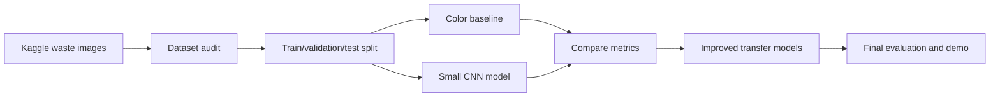
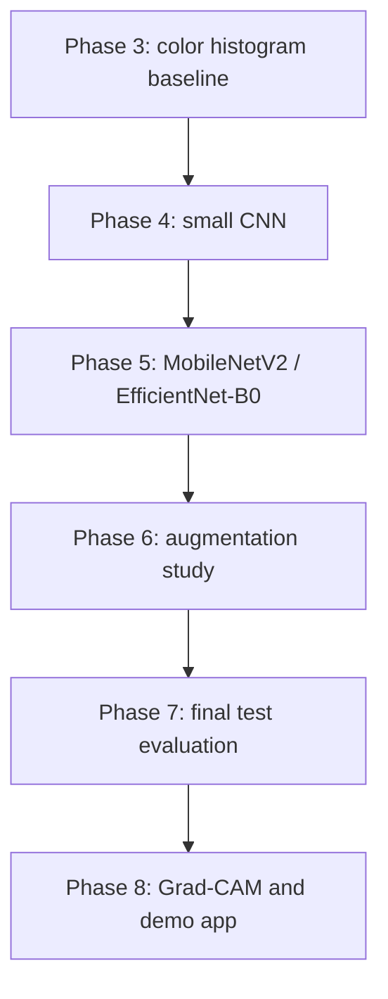
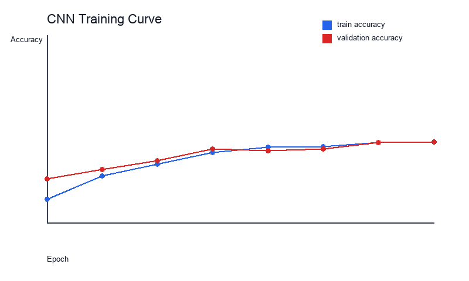
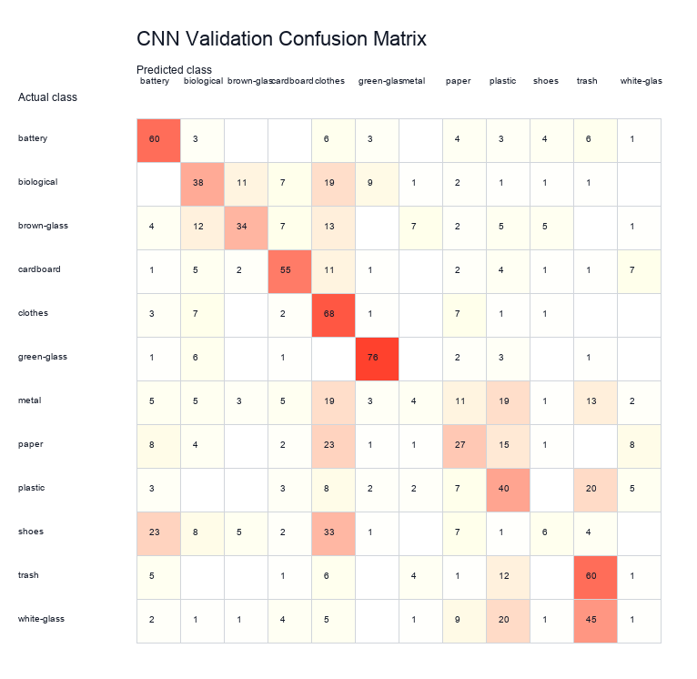

# Waste Image Classification

Group G20 - Project P04

This project classifies household waste images into 12 waste classes. The goal is to build a clear computer vision pipeline, compare a simple baseline with improved models, and explain the results with proper evaluation.

## Team

- E/22/051
- E/22/385
- E/22/227
- E/22/004

## Dataset

We use the Kaggle Garbage Classification dataset:

https://www.kaggle.com/datasets/mostafaabla/garbage-classification

The Kaggle page describes the dataset as a 12-class household waste image dataset. The local copy used in this project has 15,515 readable JPG images.

- paper
- cardboard
- biological
- metal
- plastic
- green-glass
- brown-glass
- white-glass
- clothes
- shoes
- battery
- trash

The full dataset is not committed to this repository. Download it from Kaggle and place it inside:

```text
data/raw/
```

## Project Plan

We will do the project in this order:

1. Inspect the dataset and check class counts.
2. Split images into train, validation, and test sets.
3. Train a simple baseline model.
4. Fine-tune MobileNetV2 and EfficientNet-B0.
5. Compare results with accuracy, precision, recall, F1-score, and confusion matrix.
6. Study the effect of data augmentation.
7. Generate Grad-CAM examples for correct and wrong predictions.
8. Build a small image upload demo if the main experiments are complete.

## Project Workflow



## Model Roadmap



## Folder Structure

```text
data/              Dataset files. Not committed.
docs/              Project notes and planning.
notebooks/         Small exploration notebooks.
src/               Main Python source code.
scripts/           Command line scripts.
results/           Tables, plots, and example outputs.
models/            Trained model files. Not committed.
reports/           Report drafts and final writing.
app/               Simple demo app later.
```

## Setup

Create a Python environment and install the packages:

```bash
pip install -r requirements.txt
```

## First Check

After downloading the dataset, run:

```bash
python scripts/check_dataset.py --data-dir data/raw
```

This prints the class names and image counts. It helps us confirm that the dataset is in the expected format.

## Phase 1 Outputs

Phase 1 prepares and checks the dataset before model training.

Main files:

- `docs/phase1/phase1_learning_report_v1.md`
- `docs/phase1/dataset_audit_table_v1.md`
- `docs/phase1/class_counts_v1.csv`
- `docs/phase1/planned_split_counts_v1.csv`
- `docs/phase1/images/class_counts_v1.png`
- `docs/phase1/images/image_sizes_v1.png`
- `docs/phase1/images/sample_grid_v1.jpg`

Run the full Phase 1 audit with:

```bash
python scripts/audit_dataset.py --data-dir data/raw --output-dir docs/phase1
```

## Phase 2 Outputs

Phase 2 creates a stratified train, validation, and test split.

Main files:

- `scripts/split_dataset.py`
- `docs/phase2/phase2_split_report_v1.md`
- `docs/phase2/split_counts_v1.csv`

Run the split with:

```bash
python scripts/split_dataset.py --data-dir data/raw --output-dir data/processed/splits --report-dir docs/phase2 --seed 42
```

## Phase 3 Outputs

Phase 3 trains the first simple baseline model.

Main files:

- `scripts/train_baseline.py`
- `docs/phase3/phase3_baseline_report_v1.md`
- `docs/phase3/baseline_metrics_v1.csv`
- `docs/phase3/baseline_class_report_v1.csv`
- `docs/phase3/confusion_matrix_v1.csv`
- `docs/phase3/images/confusion_matrix_v1.png`

Run the baseline with:

```bash
python scripts/train_baseline.py --split-dir data/processed/splits --output-dir docs/phase3 --model-path models/baseline_color_hist_v1.joblib
```

## Phase 4 Outputs

Phase 4 trains the first deep learning model using plain PyTorch.

This is a small CNN. It learns from image pixels, so it can learn simple shape and texture patterns. It is not yet MobileNetV2 or EfficientNet-B0 because `torchvision` is not available in the current local environment.

The CNN code follows the usual PyTorch `nn.Module` training workflow. Reference: https://docs.pytorch.org/tutorials/recipes/recipes/defining_a_neural_network.html

Main files:

- `scripts/train_cnn.py`
- `docs/phase4/phase4_cnn_report_v1.md`
- `docs/phase4/cnn_metrics_v1.csv`
- `docs/phase4/cnn_class_report_v1.csv`
- `docs/phase4/cnn_history_v1.csv`
- `docs/phase4/cnn_confusion_matrix_v1.csv`
- `docs/phase4/images/cnn_training_curve_v1.png`
- `docs/phase4/images/cnn_confusion_matrix_v1.png`

Run the CNN model with:

```bash
python scripts/train_cnn.py --split-dir data/processed/splits --output-dir docs/phase4 --model-path models/small_cnn_v1.pt --epochs 8 --batch-size 64 --image-size 96 --max-train 0 --max-val 0 --max-train-per-class 350 --max-val-per-class 90
```

Phase 4 result:

| Model | Validation accuracy | Macro F1-score |
|---|---:|---:|
| Color histogram baseline | 0.4848 | 0.3928 |
| Small CNN | 0.4343 | 0.3950 |

Training curve:



Confusion matrix:



## AI Use Note

AI tools may be used for planning, writing support, code suggestions, and debugging. All code and results must be reviewed and understood by the team.
