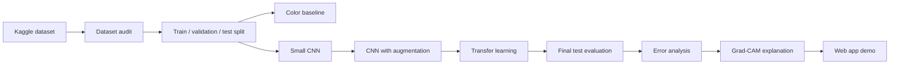
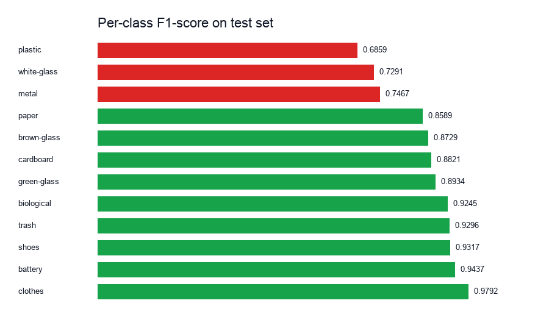
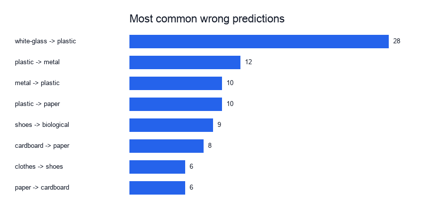

# Waste Image Classification

Group G20 - Project P04

This project classifies household waste images into 12 classes. We started with a simple baseline, improved the model step by step, and finally evaluated the best model on a separate test set.


## Team

- E/22/051
- E/22/385
- E/22/227
- E/22/004

## Dataset

Dataset source:

https://www.kaggle.com/datasets/mostafaabla/garbage-classification

The local dataset used in this project has 15,515 readable JPG images from 12 classes:

| Class | Images |
|---|---:|
| clothes | 5325 |
| shoes | 1977 |
| paper | 1050 |
| battery | 945 |
| biological | 985 |
| cardboard | 891 |
| plastic | 865 |
| metal | 769 |
| white-glass | 775 |
| trash | 697 |
| green-glass | 629 |
| brown-glass | 607 |

The dataset is not committed to GitHub. Download it from Kaggle and keep it here:

```text
data/raw/
```

## Workflow



## Current Result

The best model is **MobileNetV2 with transfer learning**. It was selected using validation macro F1-score, then evaluated once on the held-out test set.

| Metric | Value |
|---|---:|
| Test accuracy | 0.9038 |
| Macro precision | 0.8652 |
| Macro recall | 0.8688 |
| Macro F1-score | 0.8648 |
| Test images | 2329 |

The test set was used only for the final evaluation.


## Model Comparison

| Model | Validation accuracy | Macro F1-score |
|---|---:|---:|
| Color histogram baseline | 0.4848 | 0.3928 |
| Small CNN | 0.4343 | 0.3950 |
| Small CNN with augmentation | 0.4407 | 0.3992 |
| MobileNetV2 | 0.8927 | 0.8929 |
| EfficientNet-B0 | 0.8913 | 0.8909 |

## Error Analysis

Phase 8 studies the final test mistakes. The weakest classes are mainly plastic, white-glass, and metal.

| Class | Test F1-score |
|---|---:|
| plastic | 0.6859 |
| white-glass | 0.7291 |
| metal | 0.7467 |

The most common mistake is **white-glass predicted as plastic**. This makes sense because both can look transparent or shiny in photos.





## Grad-CAM

Phase 9 adds Grad-CAM support. Grad-CAM creates heatmaps that show which image regions affected a model prediction.

Run it after the MobileNetV2 checkpoint is available locally:

```bash
python3 scripts/generate_gradcam.py --split-dir data/processed/splits --model-path models/mobilenet_v2_v1.pt --model-name mobilenet_v2 --output-dir docs/phase9
```

The script saves correct and wrong prediction heatmaps in:

```text
docs/phase9/images/
```

## Project Structure

```text
data/              Local dataset and split files. Not committed.
docs/              Reports, charts, and project notes.
models/            Trained model files. Not committed.
reports/           Report drafts.
scripts/           Main scripts for each phase.
src/               Small shared project config.
```

## Setup

Create a Python environment and install the required packages:

```bash
pip install -r requirements.txt
```

If your terminal uses `python3`, run scripts with `python3`.

## Main Commands

Check the dataset:

```bash
python3 scripts/check_dataset.py --data-dir data/raw
```

Create the split:

```bash
python3 scripts/split_dataset.py --data-dir data/raw --output-dir data/processed/splits --report-dir docs/phase2 --seed 42
```

Train the baseline:

```bash
python3 scripts/train_baseline.py --split-dir data/processed/splits --output-dir docs/phase3 --model-path models/baseline_color_hist_v1.joblib
```

Train MobileNetV2:

```bash
python3 scripts/train_transfer.py --model mobilenet_v2 --epochs 5 --batch-size 32 --image-size 224 --max-train-per-class 500 --max-val-per-class 120 --augment
```

Run final evaluation:

```bash
python3 scripts/evaluate_final.py --split-dir data/processed/splits --model-path models/mobilenet_v2_v1.pt --model-name mobilenet_v2 --output-dir docs/phase7
```

Run error analysis:

```bash
python3 scripts/analyze_errors.py --phase7-dir docs/phase7 --output-dir docs/phase8
```

Run Grad-CAM:

```bash
python3 scripts/generate_gradcam.py --split-dir data/processed/splits --model-path models/mobilenet_v2_v1.pt --model-name mobilenet_v2 --output-dir docs/phase9
```

## Web App Demo (Phase 11)

A simple Streamlit demo app lets you upload a waste image and see the MobileNetV2 prediction in the browser.

```bash
streamlit run app/app.py
```

Or:

```bash
python3 -m streamlit run app/app.py
```

The app opens at `http://localhost:8501`.

The trained model checkpoint is not committed to GitHub. Place `mobilenet_v2_v1.pt` inside `models/` to enable predictions. The app still opens without the checkpoint and shows a clear message.

See [app/README.md](app/README.md) for full instructions.


## Phase Outputs

| Phase | Main output |
|---|---|
| Phase 1 | Dataset audit and class distribution |
| Phase 2 | Stratified train, validation, and test split |
| Phase 3 | Color histogram baseline |
| Phase 4 | Small CNN model |
| Phase 5 | CNN augmentation study |
| Phase 6 | Transfer learning with MobileNetV2 and EfficientNet-B0 |
| Phase 7 | Final test evaluation |
| Phase 8 | Error analysis |
| Phase 9 | Grad-CAM explainability script |
| Phase 11 | Streamlit web app demo |
