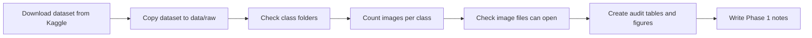
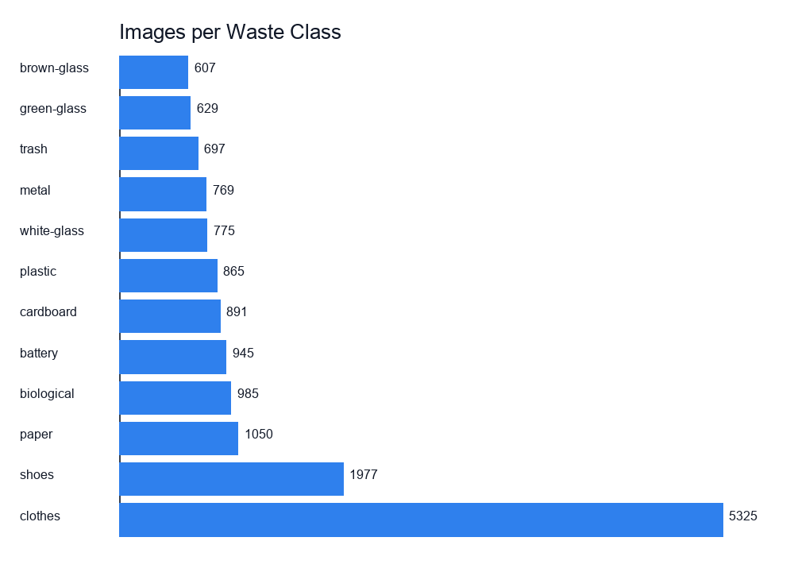
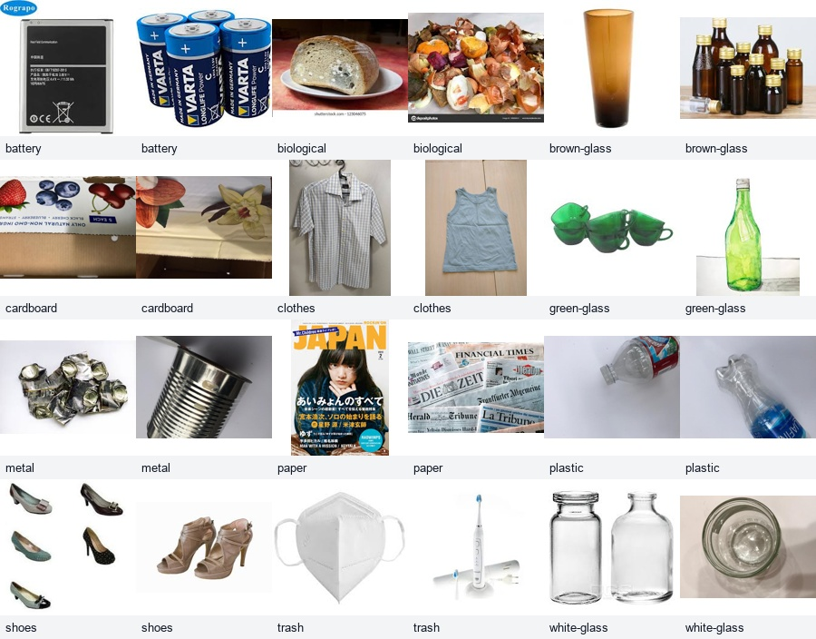
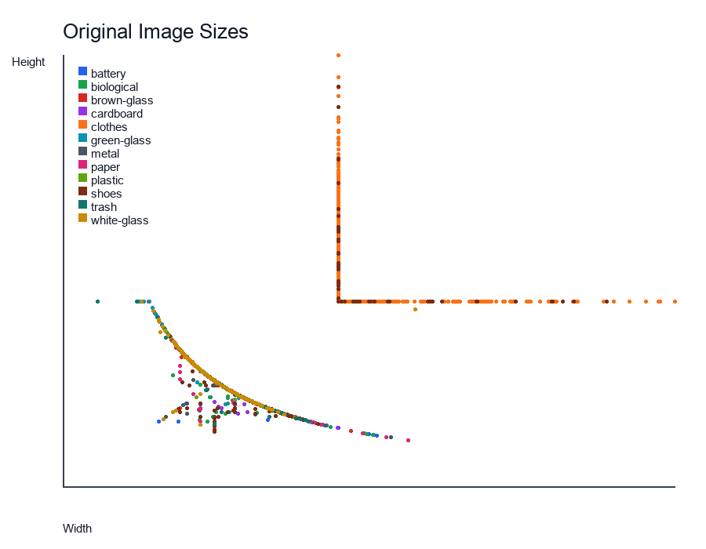

# Phase 1 Learning Report v1

## Phase 1 Goal

In Phase 1, we prepared the dataset and checked whether it is ready for model training.

This step is important because a model can only learn correctly if the data is organized correctly. If class names, image counts, or image files are wrong, later training results can become confusing.

## What We Did

We started from the downloaded dataset folder:

```text
/Users/bhaveenthankajanikanth/Downloads/garbage_classification
```

Then we copied it into the project workspace:

```text
data/raw/
```

The `data/raw/` folder is ignored by Git. This is intentional. The dataset is needed locally for training, but it should not be uploaded to GitHub because it is large and has license conditions.

## Current Project Structure

```text
e22-co5430-waste-image-classification/
├── app/
├── data/
│   ├── raw/
│   └── processed/
├── docs/
│   ├── phase1/
│   ├── dataset_notes_v1.md
│   ├── experiment_log_v1.md
│   └── project_plan_v1.md
├── models/
├── notebooks/
├── reports/
├── results/
├── scripts/
└── src/
```

## Simple Workflow



## Technical Terms

**Dataset** means the full collection of images that we use for the project.

**Class** means the correct category of an image. Here, examples are `plastic`, `paper`, `metal`, and `battery`.

**Label** means the answer given to an image. In this dataset, the folder name acts as the label.

**Raw data** means the original dataset before we resize, split, or change it.

**Audit** means checking the dataset carefully before using it.

**Class imbalance** means some classes have many more images than others. This can make the model prefer the bigger classes.

## Dataset Source

Dataset: Garbage Classification by Mostafa Mohamed on Kaggle

Link: https://www.kaggle.com/datasets/mostafaabla/garbage-classification

Kaggle describes it as a household garbage image dataset with 12 classes. The Kaggle page also notes that some images were collected from the web and some came from other datasets.

License note from Kaggle: Database: Open Database, Contents: Original Authors.

## Local Dataset Result

Our local downloaded copy contains 15,515 readable images.

The proposal mentioned around 15,150 images because that is the dataset page description. For our real experiments, we should report the number found by our local audit: 15,515.

## Class Count Table

| Class | Images | Width Range | Height Range |
|---|---:|---:|---:|
| battery | 945 | 140-456 | 110-306 |
| biological | 985 | 156-450 | 112-324 |
| brown-glass | 607 | 125-512 | 120-400 |
| cardboard | 891 | 160-512 | 126-384 |
| clothes | 5325 | 400-888 | 400-936 |
| green-glass | 629 | 110-512 | 142-400 |
| metal | 769 | 150-512 | 106-384 |
| paper | 1050 | 159-512 | 100-384 |
| plastic | 865 | 140-512 | 146-384 |
| shoes | 1977 | 153-790 | 119-867 |
| trash | 697 | 51-381 | 132-400 |
| white-glass | 775 | 114-512 | 133-400 |

## Class Distribution



This chart shows that `clothes` has far more images than the other classes. `shoes` is also larger than most classes.

This matters because the model may learn these larger classes better. It may also become biased toward predicting them. Because of this, we should use macro F1-score during evaluation, not only accuracy.

## Sample Images



The sample grid helps us understand the dataset visually.

Some images look like clean product photos rather than real waste on a recycling line. This is an important dataset limitation. It means the model may perform well on this dataset but may not directly work perfectly in a real recycling environment.

## Image Size Check



The images have different widths and heights. For model training, we will resize them to a fixed size.

Planned training size:

```text
224 x 224 pixels
```

This size is commonly used by pretrained models such as MobileNetV2 and EfficientNet-B0.

## File Quality Check

Phase 1 audit found:

| Check | Result |
|---|---:|
| Class folders | 12 |
| Readable images | 15,515 |
| Unreadable images | 0 |
| JPG files | 15,515 |
| RGB images | 15,481 |
| P-mode images | 34 |

P-mode images use a palette format. This is not a problem because our training pipeline will convert all images to RGB before using them.

## Issues Found Early

| Issue | Why It Matters | What We Will Do |
|---|---|---|
| Class imbalance | Some classes may dominate training. | Use stratified split and macro F1-score. |
| `battery` folder name | Proposal says batteries, but folder says battery. | Use `battery` in code to match the dataset. |
| Different image sizes | Models need same input size. | Resize images to 224 x 224. |
| Some product-like images | Dataset may not fully match real waste scenes. | Mention this limitation and show failure cases later. |
| Web-collected images | Source quality may vary. | Cite dataset and discuss license/limitations. |

## Why This Phase Matters

This phase prevents future mistakes.

If we directly start training without checking the dataset, we may later get wrong results and not know why. Now we know the exact class names, exact image count, image format, and main dataset risks.

## Planned Split Counts

This is not the actual split yet. It is the expected count if we split each class using 70% training, 15% validation, and 15% testing.

| Class | Total | Train | Validation | Test |
|---|---:|---:|---:|---:|
| battery | 945 | 661 | 142 | 142 |
| biological | 985 | 689 | 148 | 148 |
| brown-glass | 607 | 425 | 91 | 91 |
| cardboard | 891 | 623 | 134 | 134 |
| clothes | 5325 | 3727 | 799 | 799 |
| green-glass | 629 | 441 | 94 | 94 |
| metal | 769 | 539 | 115 | 115 |
| paper | 1050 | 734 | 158 | 158 |
| plastic | 865 | 605 | 130 | 130 |
| shoes | 1977 | 1383 | 297 | 297 |
| trash | 697 | 487 | 105 | 105 |
| white-glass | 775 | 543 | 116 | 116 |

## Commands Used

Check the dataset:

```bash
python scripts/check_dataset.py --data-dir data/raw
```

Run the full audit:

```bash
python scripts/audit_dataset.py --data-dir data/raw --output-dir docs/phase1
```

## Phase 1 Status

Phase 1 is complete.

Completed:

- Dataset copied to `data/raw/`
- Dataset kept out of Git
- Class folders checked
- Image counts checked
- Bad image check completed
- Class-count chart created
- Sample image grid created
- Image-size plot created
- Dataset risks identified

## Next Phase

Phase 2 should create the train, validation, and test split.

Planned split:

```text
70% train
15% validation
15% test
```

The split should be stratified. That means every class should keep almost the same percentage in train, validation, and test sets.
