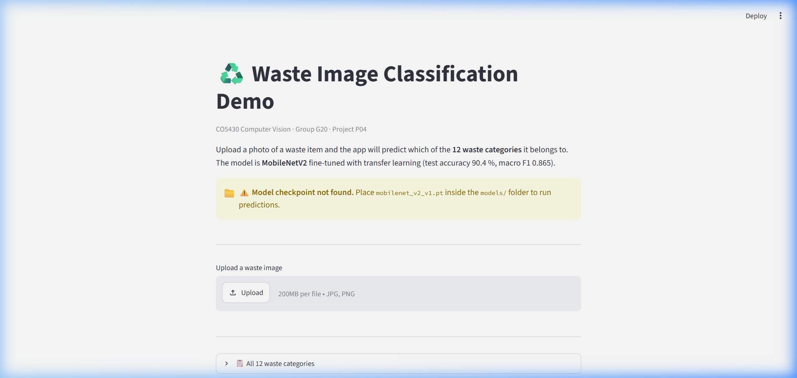

# Phase 11 - Web App Demo

## Summary

Phase 11 adds a simple Streamlit demo app for the waste image classification project.
The app lets users upload a waste image and see the model prediction in the browser.
It is designed to be easy to run locally and easy to explain in a viva.

## What the app does

1. The user opens the app in a browser.
2. The user uploads a JPG, JPEG, or PNG photo of a waste item.
3. The app shows a preview of the uploaded image.
4. If the MobileNetV2 checkpoint is present, it runs the model and shows:
   - Predicted class name
   - Confidence score as a percentage
   - Top 3 predictions with confidence bars
   - A short disposal note for the predicted class
5. If the checkpoint file is missing, the app still opens and shows a clear warning message. It does not crash.

## Model details

- Model: MobileNetV2 (transfer learning from ImageNet weights)
- Checkpoint file: `models/mobilenet_v2_v1.pt`
- The checkpoint stores: `model_state_dict`, `class_to_index`, `image_size`, `metrics`
- The checkpoint is not committed to GitHub. It must be placed locally.

## Preprocessing

The app uses the same preprocessing pipeline as Phase 6 training:

1. Open image with PIL
2. Convert to RGB
3. Resize to `image_size x image_size` (default 224)
4. Convert to float array and divide by 255.0
5. Convert to PyTorch tensor, reshape to C x H x W
6. Normalize with ImageNet mean and std:
   - mean = [0.485, 0.456, 0.406]
   - std  = [0.229, 0.224, 0.225]

## Files added

| File | Description |
|---|---|
| `app/app.py` | Main Streamlit app |
| `app/README.md` | Run instructions |

## How to run

```bash
streamlit run app/app.py
```

Or:

```bash
python3 -m streamlit run app/app.py
```

## Test plan

1. Run the app without the model checkpoint present. The app should open and show the missing checkpoint warning.
2. Place the checkpoint in `models/mobilenet_v2_v1.pt`. Reload the app. It should show the model loaded message.
3. Upload a waste image. The app should show the prediction, confidence score, and top 3 results.

## Results

- Test accuracy of MobileNetV2: 0.9038
- Macro F1-score: 0.8648
- Weakest classes: plastic, white-glass, metal

## Screenshot


