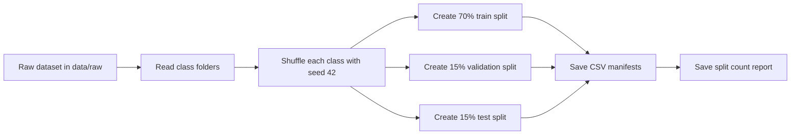

# Phase 2 Split Report v1

## Phase 2 Goal

In Phase 2, we split the dataset into training, validation, and test parts.

This is important because we should not train and test the model using the same images. If we do that, the result will look better than it really is.

## Simple Meaning

**Training set** is used to teach the model.

**Validation set** is used while improving the model. It helps us choose settings and notice overfitting.

**Test set** is used at the end. It gives the final fair result.

**Stratified split** means each waste class keeps almost the same percentage in train, validation, and test.

## Split Method

We used this split:

```text
70% train
15% validation
15% test
```

We used random seed `42`. This means the same split can be created again later.

We did not copy images into new folders. Instead, we created CSV files that store the image path and class name. This avoids duplicate image files and keeps the project clean.

## Workflow



## Split Count Table

| Class | Total | Train | Validation | Test |
|---|---:|---:|---:|---:|
| battery | 945 | 661 | 142 | 142 |
| biological | 985 | 689 | 148 | 148 |
| brown-glass | 607 | 425 | 91 | 91 |
| cardboard | 891 | 623 | 134 | 134 |
| clothes | 5325 | 3727 | 799 | 799 |
| green-glass | 629 | 441 | 94 | 94 |
| metal | 769 | 539 | 115 | 115 |
| paper | 1050 | 734 | 158 | 158 |
| plastic | 865 | 605 | 130 | 130 |
| shoes | 1977 | 1383 | 297 | 297 |
| trash | 697 | 487 | 105 | 105 |
| white-glass | 775 | 543 | 116 | 116 |

## Final Split Size

| Split | Images |
|---|---:|
| Train | 10,857 |
| Validation | 2,329 |
| Test | 2,329 |
| Total | 15,515 |

## Files Created

Local split files:

```text
data/processed/splits/train_v1.csv
data/processed/splits/val_v1.csv
data/processed/splits/test_v1.csv
data/processed/splits/split_counts_v1.csv
```

These files are ignored by Git because they are generated files.

Report file saved for Git:

```text
docs/phase2/split_counts_v1.csv
```

## Command Used

```bash
python3 scripts/split_dataset.py --data-dir data/raw --output-dir data/processed/splits --report-dir docs/phase2 --seed 42
```

## Phase 2 Status

Phase 2 is complete.

Completed:

- Stratified split created
- Train, validation, and test CSV files generated
- Split count report generated
- Same random seed fixed for reproducibility
- No image duplication was done

## Next Phase

Phase 3 should build the first baseline model.

The baseline should be simple. It gives us a starting result to compare with MobileNetV2 and EfficientNet-B0 later.
