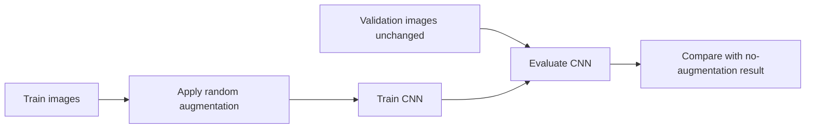
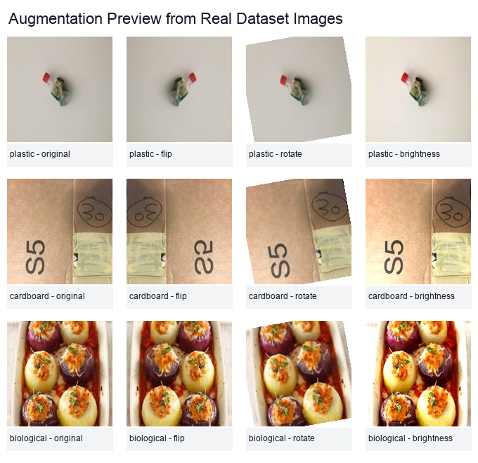
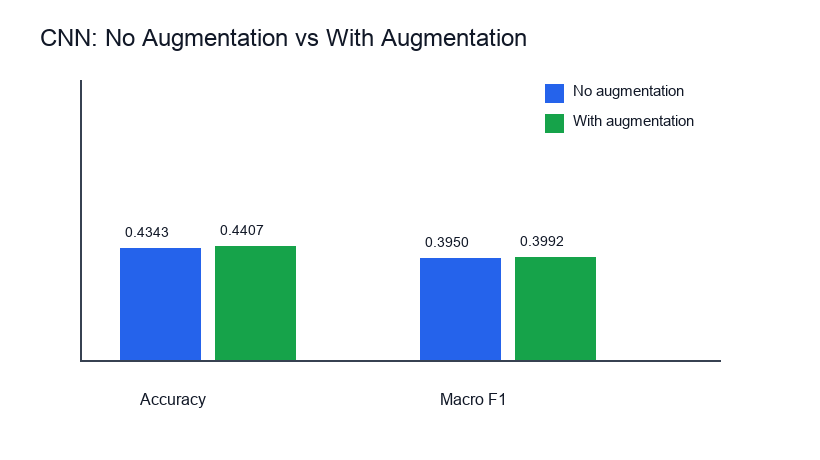
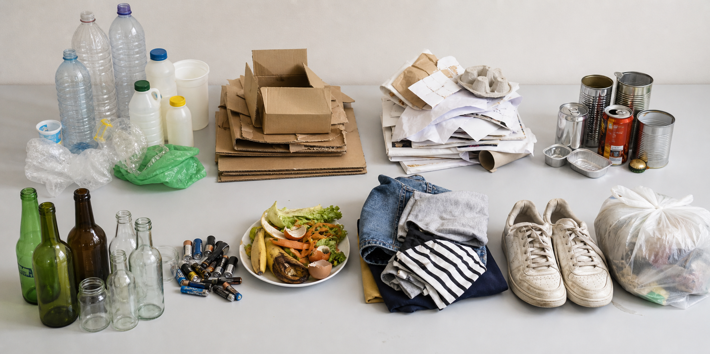

# Phase 5 Augmentation Study v1

## Phase 5 Goal

In this phase, we checked whether simple image augmentation helps the CNN model.

Augmentation means we slightly change training images so the model sees more variety. This helps the model learn that the same object can appear in different positions, angles, and lighting.

## Augmentations Used

Only the training images were augmented.

The validation images were not changed. This keeps the evaluation fair.

Used augmentations:

- horizontal flip
- small rotation
- small brightness change
- small contrast change

## Workflow



## Visual Example



This image shows how one training image can produce slightly different versions. The class label stays the same.

## Result

| Model | Augmentation | Validation accuracy | Macro F1-score |
|---|---|---:|---:|
| Small CNN | No | 0.4343 | 0.3950 |
| Small CNN | Yes | 0.4407 | 0.3992 |



## What We Learned

Augmentation gave a small improvement.

Accuracy improved from 0.4343 to 0.4407. Macro F1-score improved from 0.3950 to 0.3992.

The improvement is not large, but it is useful. It shows that the model benefits from seeing more varied training images.

## Realistic Project Visual



This generated visual is only used for README/report presentation. It is not used for training or evaluation.

## Figma Note

The Figma connector is available, but it needs a Figma design file key or URL before it can write frames into Figma.

For now, the visual assets are saved in the repository. They can be imported into Figma later.

## Files Created

```text
docs/phase5/phase5_augmentation_report_v1.md
docs/phase5/augmentation_comparison_v1.csv
docs/phase5/with_aug/cnn_metrics_v1.csv
docs/phase5/with_aug/cnn_class_report_v1.csv
docs/phase5/with_aug/cnn_history_v1.csv
docs/phase5/with_aug/cnn_confusion_matrix_v1.csv
docs/phase5/with_aug/phase5_with_aug_cnn_report_v1.md
docs/phase5/with_aug/images/cnn_training_curve_v1.png
docs/phase5/with_aug/images/cnn_confusion_matrix_v1.png
docs/phase5/images/augmentation_preview_v1.jpg
docs/phase5/images/augmentation_metric_comparison_v1.png
docs/phase5/images/waste_items_realistic_v1.png
models/small_cnn_aug_v1.pt
```

The model file is local only and ignored by Git.

## Command Used

```bash
python3 scripts/train_cnn.py --split-dir data/processed/splits --output-dir docs/phase5/with_aug --model-path models/small_cnn_aug_v1.pt --epochs 8 --batch-size 64 --image-size 96 --max-train 0 --max-val 0 --max-train-per-class 350 --max-val-per-class 90 --augment --report-file-name phase5_with_aug_cnn_report_v1.md
```

## Next Phase

Next, we should move to stronger models. The best next step is MobileNetV2 or EfficientNet-B0 if `torchvision` and pretrained weights are available.
