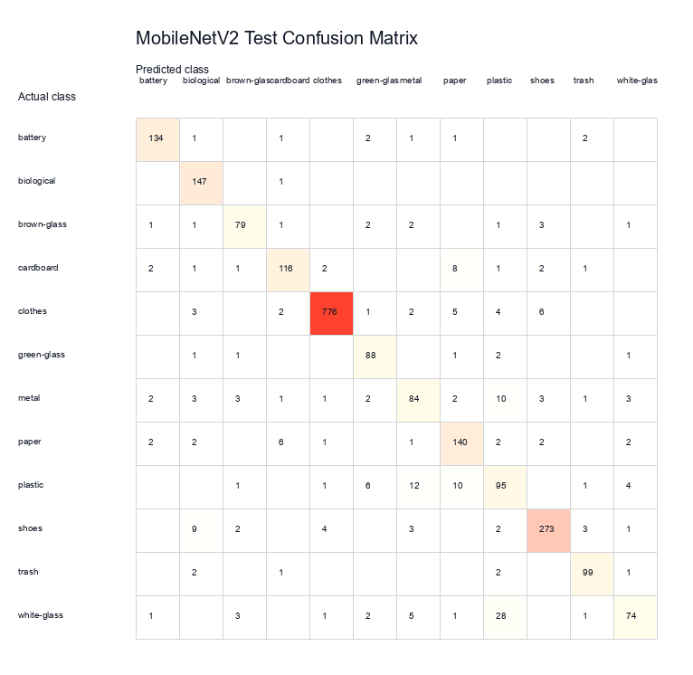
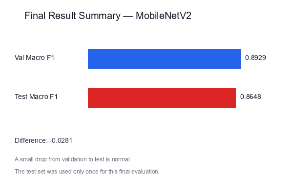
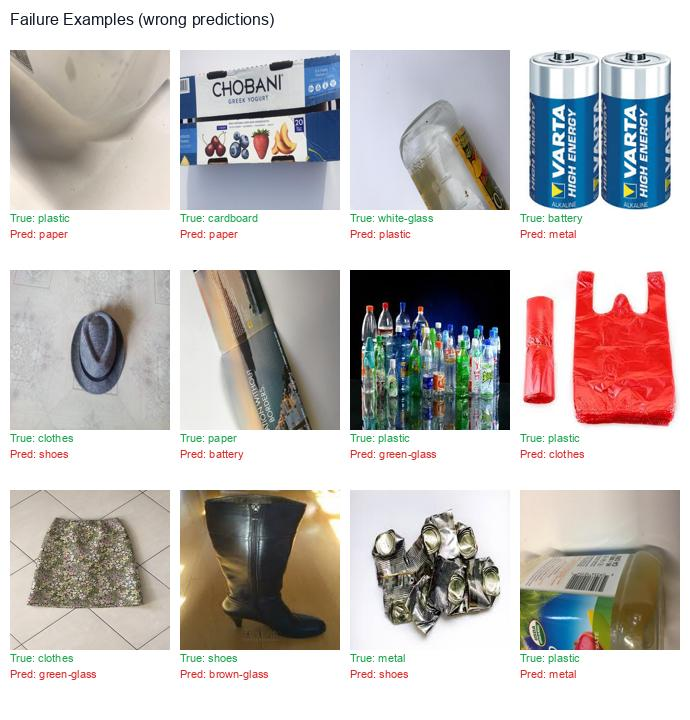

# Phase 7: Final Test Evaluation Report

## What this phase does

Phase 7 evaluates the best model from Phase 6 on the held-out test set. This is the first and only time the test set is used. No training or tuning was done in this phase.

The "test set" means images that were kept aside and never seen during training or validation. This gives us an honest measure of how the model performs on new, unseen images.

## Model selected

We selected **MobileNetV2** because it had the best validation macro F1-score among the Phase 6 transfer learning models.

"Macro F1-score" gives equal importance to every class, which is important because our dataset is imbalanced (some classes have more images than others).

- Checkpoint: `models\mobilenet_v2_v1.pt`
- Image size: 224 x 224
- Date: 2026-07-29 17:21

## Final test results

| Metric | Value |
|---|---:|
| Test accuracy | 0.9038 |
| Macro precision | 0.8652 |
| Macro recall | 0.8688 |
| Macro F1-score | 0.8648 |
| Total test images | 2329 |

## Confusion matrix

The confusion matrix shows which classes are confused with each other. Darker cells mean more images were classified that way.

## Result summary

This chart compares the validation macro F1 (from Phase 6) with the test macro F1 (from this phase).

## Failure Analysis

We looked at the most confused class pairs in the confusion matrix to understand where the model struggles.

- **white-glass** confused as **plastic** (28 times): Both can appear transparent or translucent.
- **plastic** confused as **metal** (12 times): These classes may share visual features.
- **metal** confused as **plastic** (10 times): These classes may share visual features.
- **plastic** confused as **paper** (10 times): These classes may share visual features.
- **shoes** confused as **biological** (9 times): These classes may share visual features.

### Failure examples

Below are some examples where the model predicted the wrong class. Each image shows the true label and the predicted label.

### Why some classes are difficult

- **Glass types** (green-glass, brown-glass, white-glass) share very similar bottle and jar shapes. The model must rely on color, which can be tricky with lighting variation.
- **Paper and cardboard** both have flat, fibrous textures. The difference is mostly thickness, which is hard to see in a photo.
- **Trash** is a catch-all category with no consistent visual pattern, making it inherently hard.
- **Plastic** items come in many shapes and colors, overlapping with glass (transparent items) and trash.

## Important notes

- The test set was used **only once** in this phase.
- No training was done in Phase 7.
- No hyperparameter tuning was done using the test set.
- The model was not changed after seeing test results.
- These are the final, honest results.
